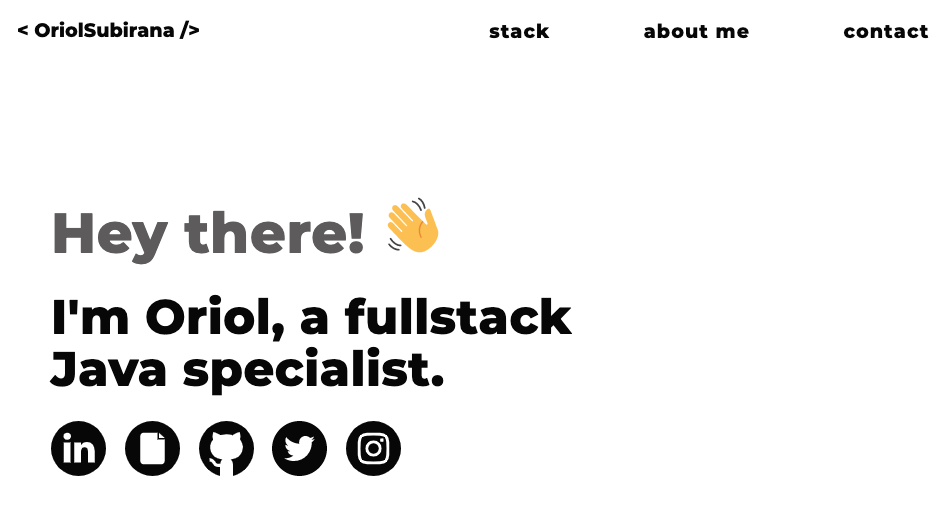

# Oriol Subirana Personal site

 

  

## Next steps

* Switch button to change theme
* Personal blog and tutorials

## Build with

* [Gatsby](https://github.com/gatsbyjs/gatsby)
* [React](https://github.com/facebook/react)

## Starting point

* [gatsby-starter-hello-world](https://github.com/gatsbyjs/gatsby-starter-hello-world)

## Setup

1. Install gatsby-cli ([docs](https://www.gatsbyjs.org/tutorial/part-one/#install-the-hello-world-starter))
2. Clone the repository to your localhost
3. Install dependencies (npm install)
4. Use npm start to start in development mode ([docs](https://www.gatsbyjs.org/docs/))
5. Enjoy.

## Me

  